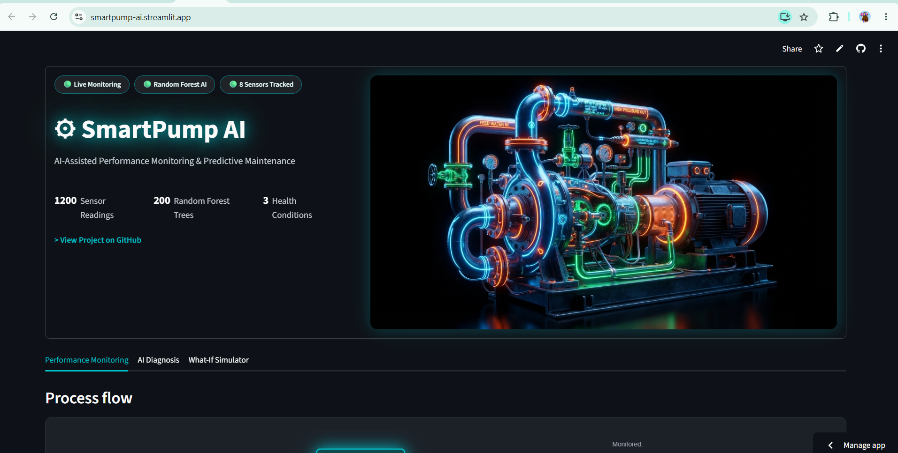

# SmartPump AI

🔴 **[Live Demo](https://smartpump-ai.streamlit.app/)**  
💻 **[GitHub Repository](https://github.com/agriya2006655/smartpump-ai)**

## Project Preview



AI-assisted performance monitoring & predictive maintenance dashboard for a
boiler feedwater pump, built with simulated sensor data.

⚠️ Note: all pump sensor data used here is **simulated**, generated to
resemble realistic operating patterns — not from a real industrial pump.

## What's in this folder

| File | What it does |
|---|---|
| `generate_data.py` | Creates the simulated sensor dataset → `pump_data.csv` |
| `pump_data.csv` | The dataset (already generated for you) |
| `train_model.py` | Trains a Random Forest model on the dataset → `pump_model.pkl` |
| `pump_model.pkl` | The trained model (already trained for you) |
| `app.py` | The Streamlit dashboard (graphs + AI diagnosis + what-if simulator) |
| `requirements.txt` | Python packages needed |

## How to run it on your own laptop

1. **Install Python** (3.9+) if you don't have it: https://www.python.org/downloads/

2. **Open a terminal** in this folder and install the packages:
   ```
   pip install -r requirements.txt
   ```

3. **(Already done for you, but if you want to redo it):**
   ```
   python generate_data.py
   python train_model.py
   ```
   This regenerates the CSV and retrains the model.

4. **Launch the dashboard:**
   ```
   streamlit run app.py
   ```
   Your browser will open automatically to `http://localhost:8501` showing
   the live dashboard.

## What each tab does

- **Performance Monitoring** — line graphs of every sensor over time, plus
  a breakdown of how many readings were Normal/Warning/Failure Risk.
- **AI Diagnosis** — takes the most recent sensor reading, predicts the
  pump's health status and failure risk %, and shows which sensors
  influenced that prediction the most.
- **What-If Simulator** — drag sliders to set your own sensor values, hit
  "RUN AI DIAGNOSTIC," and see the prediction update live. This is the
  most impressive part to demo to a recruiter or in an interview.

## Talking points for interviews

- Why Random Forest: works well on structured/tabular sensor data,
  handles non-linear relationships, and gives free feature importance
  for explainability — you don't have to justify a black-box model.
- Why simulated data: real industrial sensor data is proprietary/hard to
  access as a student; you designed realistic, physically-plausible
  ranges for each condition instead of random noise.
- The "AI Diagnosis" isn't just a label — you show *why* (feature
  importance), which is what separates this from a toy classifier.
